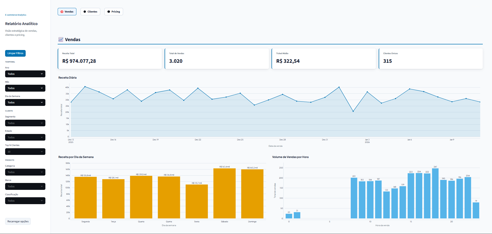
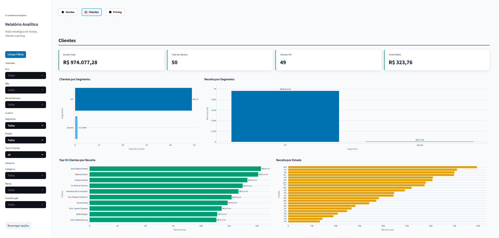
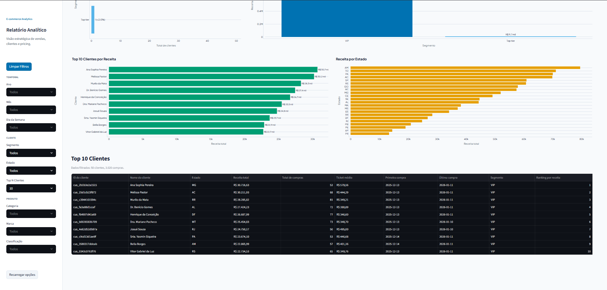
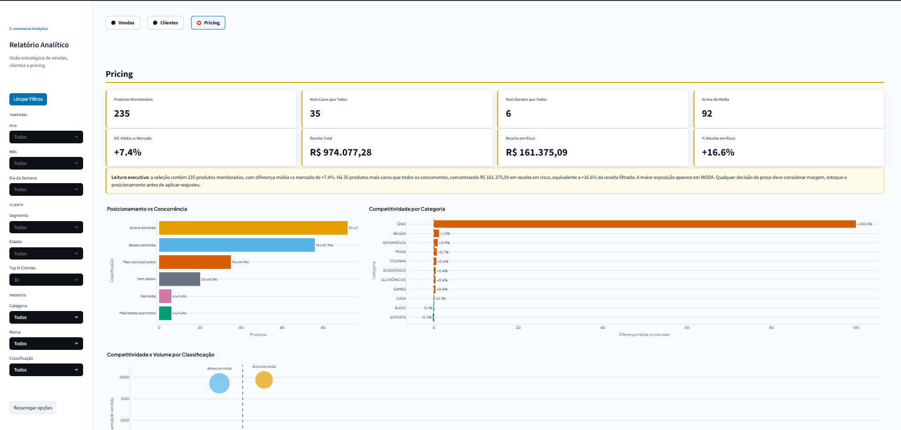
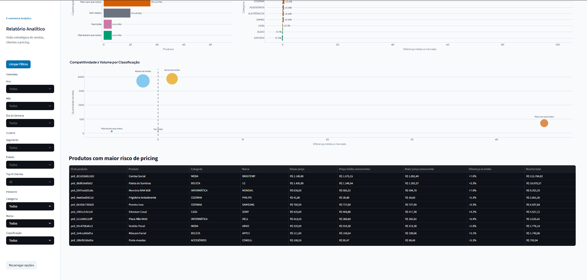

# Pipeline ELT de Engenharia de Dados para E-commerce

## 📋 Sobre

Pipeline ELT completo de ponta a ponta para analytics de e-commerce. O projeto cobre toda a cadeia de dados: extração de arquivos Parquet de um bucket S3, carga no PostgreSQL e transformação via dbt com Arquitetura Medalhão (Bronze → Silver → Gold).

Sobre os dados brutos, foram construídas duas aplicações analíticas como cases práticos: um **Dashboard Streamlit** com três páginas para diretores e um **Agente de IA via Telegram** com Claude (Anthropic API).

Projeto de portfólio/aprendizado que cobre engenharia de dados, modelagem dimensional e consumo analítico real.

---

## 🎯 Objetivos de Aprendizado

- Construir um pipeline ELT com Python (boto3, pandas, SQLAlchemy)
- Modelar dados com dbt seguindo a Arquitetura Medalhão (Bronze → Silver → Gold)
- Aplicar qualidade de dados: deduplicação, tipagem, padronização e integridade referencial
- Criar Data Marts analíticos por área de negócio (Vendas, Customer Success, Pricing)
- Consumir dados via Streamlit (Case 01) e agente de IA via Telegram com Claude API (Case 02)
- Gerenciar ambiente com uv workspace, Docker e variáveis de ambiente seguras

---

## 📁 Estrutura do Projeto

```text
projeto-pipeline-ELT-engenharia-supabase-dbt/
│
├── extract_load/                    # Pacote Python: extração S3 e carga PostgreSQL
│   ├── src/extract_load/
│   │   ├── config.py                # Settings via pydantic-settings
│   │   ├── extract.py               # Leitura dos Parquets do S3
│   │   ├── load.py                  # Carga no PostgreSQL via SQLAlchemy
│   │   └── __main__.py              # Orquestrador: extract → load
│   └── tests/                       # Testes com mocks de boto3 e SQLite in-memory
│
├── transform/                       # Pacote dbt: modelos Bronze → Silver → Gold
│   ├── models/
│   │   ├── _sources.yml             # Fontes raw (schema public)
│   │   ├── bronze/                  # 4 views — cópia fiel das fontes
│   │   ├── silver/                  # 4 tabelas — dados limpos e conformados
│   │   └── gold/
│   │       ├── dimensional/         # Dimensões e fatos reutilizáveis
│   │       └── marts/               # Data Marts por área (sales, cs, pricing)
│   ├── dbt_project.yml
│   └── profiles.yml
│
├── .llm/                            # Cases práticos sobre o pipeline
│   ├── case-01-dashboard/           # Case 01: Dashboard Streamlit (completo)
│   │   ├── app.py
│   │   ├── views/                   # vendas.py, clientes.py, pricing.py
│   │   ├── db.py
│   │   ├── filters.py
│   │   └── tests/
│   └── case-02-telegram/            # Case 02: Agente Telegram + Claude API (em construção)
│       └── PRD-agente-relatorios.md
│
├── assets/
│   └── dashboard/                   # Screenshots do Case 01
│
├── scripts/
│   └── run-pipeline.sh              # Atalho: EL + dbt run em sequência
│
├── docker-compose.yml
├── pyproject.toml                   # uv workspace root
└── .env.example                     # Template de variáveis de ambiente
```

---

## 🏗️ Arquitetura Medalhão

O pipeline segue a Arquitetura Medalhão, onde cada camada tem uma responsabilidade clara:

```text
[ S3 Bucket ]  →  [ Extract & Load ]  →  [ PostgreSQL: schema public ]
  Parquets         boto3 + pandas            tabelas raw brutas
  (vendas,         SQLAlchemy
   clientes,
   produtos,
   preco_comp.)
                                                      │
                              ┌───────────────────────┼───────────────────────┐
                              ▼                       ▼                       ▼
                         BRONZE                    SILVER                   GOLD
                        (VIEWs)                  (TABLEs)                (TABLEs)
                   ─────────────────        ─────────────────       ──────────────────
                   Cópia fiel das           Dados limpos,           Modelo dimensional:
                   fontes raw.              tipados e               dimensões, fatos e
                   Sem transformação.       deduplicados.           marts por área.
                   Contrato do dado.        Integridade             Pronto para consumo
                                            referencial             analítico.
                                            garantida.
```

**Bronze** — Espelho exato das tabelas raw (`bronze_vendas`, `bronze_clientes`, `bronze_produtos`, `bronze_preco_competidores`). Materializado como VIEW. Nenhuma transformação — serve como contrato do dado bruto.

**Silver** — Limpeza, tipagem correta, deduplicação por chave natural, padronização textual (`trim`, caixa consistente, `NAO_INFORMADO` para nulos descritivos) e integridade referencial (produtos inferidos quando ausentes no catálogo). Materializado como TABLE.

**Gold** — Modelo dimensional com dimensões (`gold_dim_clientes`, `gold_dim_produtos`, `gold_dim_datas`, `gold_dim_concorrentes`) e fatos (`gold_fct_vendas`, `gold_fct_precos_competidores`). Os marts finais respondem perguntas de negócio específicas por área: Sales, Customer Success e Pricing.

---

## 📚 Conteúdo

### Case 01 — Dashboard Streamlit

Dashboard self-service com três páginas para os diretores do e-commerce, consumindo os Data Marts Gold do PostgreSQL.

| Página | Perfil | Conteúdo |
|---|---|---|
| Vendas | Diretor Comercial | Receita, volume, sazonalidade por hora e dia da semana |
| Clientes | Customer Success | Segmentação, ticket médio, ranking e distribuição por estado |
| Pricing | Diretor de Pricing | Competitividade vs concorrentes, alertas de preço, posicionamento |

**Página Vendas**



**Página Clientes**





**Página Pricing**





---

### Case 02 — Agente Telegram + Claude API

> 🚧 **Em construção**

Agente de dados com três capacidades via Telegram:

1. **Chat livre** — responde qualquer pergunta sobre o e-commerce consultando o banco em tempo real via tool use (Claude executa SQL dinamicamente).
2. **Relatório executivo** — gera relatório para os 3 diretores (Comercial, CS, Pricing) com insights acionáveis a partir dos Data Marts Gold.
3. **Envio automático** — envia relatórios diretamente via API HTTP sem o bot rodando, com suporte a agendamento via cron.

---

## 🛠️ Tecnologias e Ferramentas

| Ferramenta | Propósito |
|---|---|
| Python 3.11 + uv | Runtime e gerenciador de dependências (workspace monorepo) |
| boto3 + pandas | Extração de Parquets do S3 |
| SQLAlchemy + psycopg2 | Carga e consulta no PostgreSQL |
| dbt-core + dbt-postgres | Transformação e modelagem analítica (Arquitetura Medalhão) |
| PostgreSQL (Supabase) | Data warehouse na nuvem |
| Streamlit | Dashboard analítico interativo (Case 01) |
| Claude API (Anthropic) | LLM para agente de dados com tool use (Case 02) |
| python-telegram-bot | Interface do agente via Telegram (Case 02) |
| Docker + docker-compose | Ambiente reproduzível para EL e dbt |
| ruff | Lint e formatação de código Python |
| pytest | Testes unitários |

---

## 🚀 Como Usar

### Instalação

```bash
# 1. Remover venv antiga (se existir)
rm -rf .venv

# 2. Instalar dependências com uv
uv sync --all-packages

# 3. Configurar variáveis de ambiente
cp .env.example .env
# Editar .env com credenciais reais (ver comentários no .env.example)
```

> **Supabase:** use o session pooler (porta 5432). O transaction pooler (6543) não é compatível com dbt.

### Execução — Pipeline completo (recomendado)

```bash
./scripts/run-pipeline.sh
```

Roda Extract + Load e `dbt run` em sequência. Use este atalho no dia a dia: o EL faz `DROP CASCADE` nas tabelas raw (o que apaga as views Bronze) e o `dbt run` logo em seguida reconstrói toda a cadeia Bronze → Silver → Gold.

### Execução — Etapas avulsas

```bash
# Extract + Load
uv run --package extract_load python -m extract_load

# Transform (dbt)
uv run --package transform dbt run --project-dir transform --profiles-dir transform

# Testes Python
uv run pytest

# Lint e formatação
uv run ruff check
uv run ruff format
```

### Execução — Docker

```bash
docker compose build
docker compose run --rm extract
docker compose run --rm dbt run
docker compose run --rm dbt test
```

### Dashboard — Case 01

```bash
cd .llm/case-01-dashboard
pip install -r requirements.txt
streamlit run app.py
```

---

## 📖 Recursos Adicionais

| Documento | Conteúdo |
|---|---|
| `transform/PRD-dbt.md` | Spec completa dos modelos dbt (Bronze, Silver, Gold) |
| `.llm/database.md` | Schemas completos das tabelas Gold |
| `.llm/case-01-dashboard/PRD-dashboard.md` | Spec do Dashboard Streamlit |
| `.llm/case-02-telegram/PRD-agente-relatorios.md` | Spec do Agente Telegram + Claude API |

---

## 👤 Autor

**Diogo Lessa**

[](https://www.linkedin.com/in/diogorblessa/)
